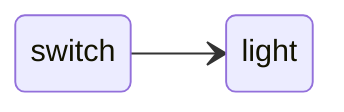
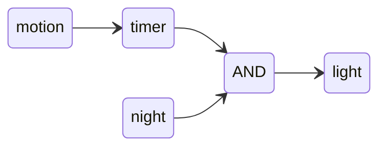
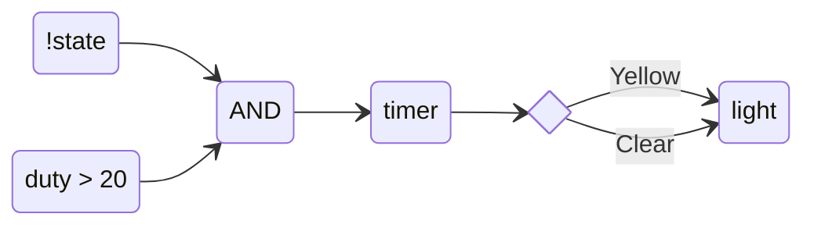
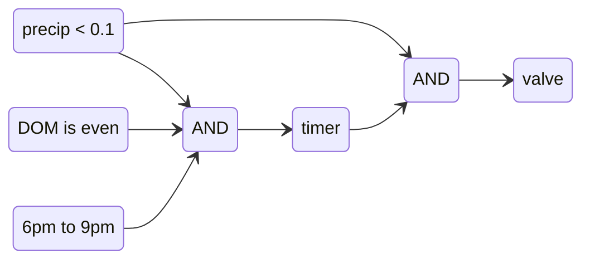
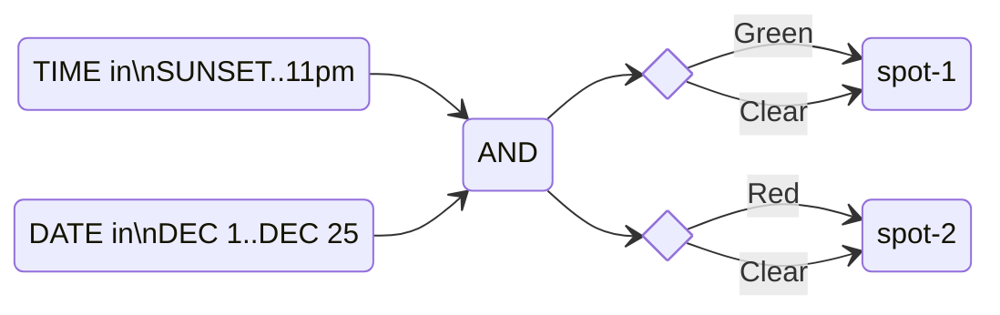

# Logic Node Proposal

This document shows several examples of how internal control might be described in the DrMem config file. This is a proposed feature and has only been partially implemented. It should be noted that, in real config files, all `[[driver]]` blocks occur first. `[[logic]]` sections must be last because they use devices which must be already defined and the TOML format doesn't allow you to switch back and forth between arrays.

Logic sections have 5 recognized keys:

| key | description |
|-----|-------------|
| `defs` | A map containing expressions. Expressions in the `exprs` array can refer to these entries to simplify or share definitions. Expressions can only use devices found in `inputs`. |
| `exprs` | An array containing control expressions. These make up the actual logic that will monitor and control devices. Expressions have two parts separated with "`->`". On the left side, only devices from `inputs` can be used. On the right, *one* device from `outputs` can be specified. |
| `inputs` | A map containing devices to be used for inputs. Expressions will use the key name when referring to the device. |
| `name` | A name for the block. This name is only used to annotate log messages. |
| `outputs` | A map containing devices to be controlled by expressions. There should be the same number of entries in this map as elements in the `exprs` array.  |

Each of the maps can pack a lot of information and could become unwieldy. Fortunately, the TOML format is very helpful here. For smaller maps, we can define it on one line. If they get too big, we can use the other form to specify each entry on a separate line.

## Examples

These examples give a varierty of ways that DrMem can control devices.

---

### Example: Control a Light with a Switch



This is the simplest possible example. An IoT wall switch controlling an IoT light bulb. For this example, the bulb simply turns on and off (no dimming or colors.)

```toml
# Using the Wyze driver for LED lights, define a room light.

[[driver]]
name = "wyze-lights"
prefix = "room:light"
cfg = { ... }

# Using the Kasa driver for WiFi wall switches, define the room's
# wall switch.

[[driver]]
name = "kasa-switch"
prefix = "room:switch"
cfg = { ... }

# Use a logic block to tie it together.

[[logic]]
inputs = { switch = "room:switch:state" }
outputs = { light = "room:light:enable" }

exprs = ["{switch} -> {light}"]
```

---

### Example: Control an Outdoor light with a Motion Sensor



This example is inspired from a GitHub issue. A motion sensor turns on a one minute timer whose output controls the state of a light, but only if it's night.

```toml
# Create devices for a 60 second timer.

[[driver]]
name = "timer"
prefix = "motion:timer"
cfg = { millis = 60_000 }

# Use the Wyze driver to create devices for the deck light.

[[driver]]
name = "wyze-lights"
prefix = "deck:light"
cfg = { ... }

# Use the Tuya driver to monitor the backyard motion sensor.

[[driver]]
name = "tuya"
prefix = "backyard::motion"
cfg = { ... }

# This logic block makes them work together.

[[logic]]
inputs = { timer = "motion:timer:output", motion = "backyard:motion:state" }
outputs = { timer = "motion:timer:enable", light = "deck:light:enable" }

exprs = ["{motion} -> {timer}",
         "{timer} AND (TIME IN SUNSET..SUNRISE) -> {light}"]
```

---

### Example: Monitor a Sump Pump



This logic block turns an LED bulb yellow if the sump pump's duty cycle is greater than 20%.

```toml
# Create devices for a 5 second timer.

[[driver]]
name = "timer"
prefix = "sump:warning"
cfg = { millis = 5_000 }

# Use the Wyze driver to create devices for the desk light.

[[driver]]
name = "wyze-lights"
prefix = "desk:light"
cfg = { ... }

# Use my custom driver to monitor the sump pump.

[[driver]]
name = "sump"
prefix = "sump"
cfg = { ... }

# Pull it together.

[[logic]]
inputs.duty = "sump:duty"
inputs.state = "sump:state"
inputs.timer = "sump:warning:enable"

outputs = { timer = "sump:warning:output", light = "desk:light:color" }

exprs = ["!{state} AND {duty} > 20.0 -> {timer}",
         "IFTE({timer}, #yellow, #clear) -> {light}"]
```

A timer's `enable` device needs to see a `false` to `true` transition in order to start timing. This means, at some point, we need to set the input back to `false`. We logically AND `!state` with the duty cycle comparison. This forces the value to go to `false` while the pump is active and `true` when it's off. If the duty cycle test is also true, the timer starts.

The if-then-else function (`IFTE()`) returns one of two colors. `#clear` is defined to be a fully transparent color.

---

### Example: Scheduling a Lawn Sprinkler.



This logic section decides when to turn on an outdoor sprinkler. In our area, we can only water our lawns on even days between 6pm and 9pm. I think 30 minutes of watering is enough and I don't want to water if it rained over 0.1" that day.

```toml
# Create the devices for a 1/2 hour timer.

[[driver]]
name = "timer"
prefix = "valve:timer"
cfg = { millis = 1_800_000 }

# Use the Weather Underground driver to get local weather info.

[[driver]]
name = "weather-wu"
prefix = "weather"
cfg = { ... }

# Use the Wyze sprinker driver to control the WiFi water valve.

[[driver]]
name = "wyze-sprinkler"
prefix = "sprinkler"
cfg = { ... }

# Intelligently control the sprinkler.

[[logic]]
inputs = { precip = "weather:precip", timer = "valve:timer:output" }

outputs = { sprinkler = "sprinkler:enable", timer = "valve:timer:enable" }

defs.no_rain = "precip < 0.1"
defs.water_time = "DOM REM 2 == 0 AND TIME IN 6pm..9pm"

exprs = ["{no_rain} AND {water_time} -> {timer}",
         "{no_rain} AND {timer} -> {sprinkler}"]
```

This example introduces a `defs` map which holds expression definitions[^1]. This can be used to shorten the expressions in the `expr` array. More importantly, if multiple expressions use a definition, the definition is only evaluated once and fed to all expressions that use it. So `defs` can reduce CPU usage, if an expression is used a lot.

---

### Example: Holiday Lights



This example sets one LED light green and another red during Dec 1st through the 26th. The lights come on at sunset and shut off at 11pm. This example doesn't require any input devices.

```toml
# Use the Philips Hue driver to create devices for the first color spotlight.

[[driver]]
name = "hue-lights"
prefix = "spot-1"
cfg = { ... }

# Use the Philips Hue driver to create devices for the second color spotlight.

[[driver]]
name = "hue-lights"
prefix = "spot-2"
cfg = { ... }

[[logic]]
outputs = { spot_1 = "spot-1:color", spot_2 = "spot-2:color" }

defs.on_time = "(TIME IN SUNSET..11pm) AND DATE IN (DEC 1..DEC 26)"

exprs = ["IFTE({on_time}, #green, #clear) -> {spot_1}",
         "IFTE({on_time}, #red, #clear) -> {spot_2}"]
```

[^1]: Maybe there should be a `[[common]]` section to define expressions that are shared across all logic blocks?
